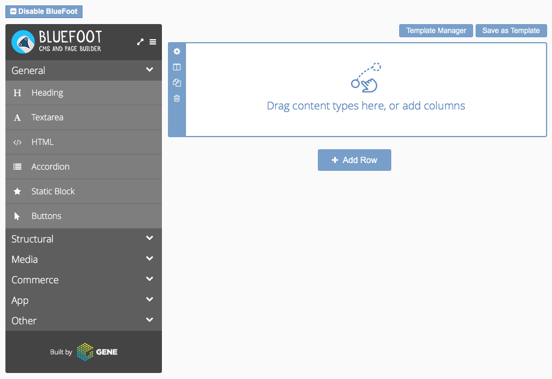

# Blue Foot: Page Builder
## Stage
The stage is one of the most important parts of the page builder. It's the area which houses all of your rows, columns & content. Along with allowing interactions between other components such as the left panel.

### Responsibilities
The stage is responsible for the majority of the interactions which happen between the user and their content. The stage is the network of the system, allow various components to all communicate and interact deeply.

#### Building & saving
The system uses two dedicated classes for the building and saving of the content, these can be found at `component/core/stage/build.js` and `component/core/stage/save.js`. Each of these classes implement various methods to ensure the system can effectively save and build any content that's created within the page builder.

##### Saving
The system iterates through all the rows, columns and entities on the page and creates objects which represent the data, along with any other extra data that would be required for the block to be rebuilt. Once it's created the nested object containing all of the pages data it turns this into a string and updates a hidden input above the stages interface. This system uses the `gene-bluefoot-stage-updated` hook to know when it needs to rebuild the object stored within the input, this ensures that the content will always be saved after any modification the user makes.

> Instead of building this on form submission we wanted to ensure that the system could be used anywhere in Magento, including Ajax and forms with overridden submit actions. 

Server side this object is parsed and the contents are commited into the EAV structure associated with each individual block. The system then replaces the raw data with a pointer to the entity so it can load it directly from the database when the data is being rendered or rebuilt.

##### Building
On load our system iterates through all of the textareas loaded upon the page, detecting whether or not they have an object attached to them. If they have an object, and it's a valid to be rebuilt the system will start iterating through the object, recreating each row, column or entity in the exact same position, with the correct associated data. As we want to avoid unnecessary loading of data the stored object will reference the store entity ID's for each page builder block. When the system loads the configuration from the server it will also pass the entity ID's to be loaded and returned in the configuration.

This also allows other developers to hook into this action to include extra data that might not have been directly stored within the entity. 
